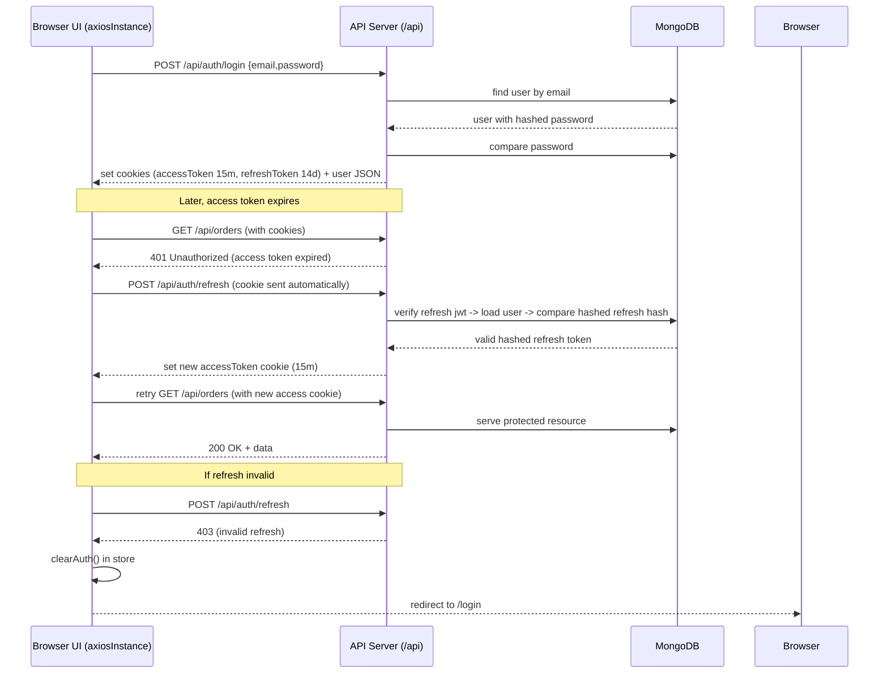

# Authentication — End-to-end (StyleShop)

> Purpose: explain architecture, data flow, and exactly how Access / Refresh tokens are created, stored and used in this repo (frontend + backend). Focus is practical and code-based.

Contents

- Overview
- High-Level Flows (Register / Login / Logout / Refresh)
- Access vs Refresh Token — deep dive (A → F)
- Frontend architecture
- Backend architecture
- API endpoints (shape)
- Security & authorization
- Edge cases
- File → responsibility mapping
- Mermaid sequence diagram

---

## 1. Overview

- What it does: Provides user registration, login, session management and protected routes using JWTs (short-lived access token + long-lived refresh token). Tokens are set as httpOnly cookies by the backend; frontend uses cookies+axios to call protected APIs and refresh tokens automatically when the access token expires.
- Supported roles: `customer`, `admin`.
- Purpose in app: Allow authenticated customers to place orders and access profile; allow admins to access admin routes; protect server endpoints using `protect` middleware that checks the access cookie.

---

## 2. High-Level Flows (Step-by-step)

Files used across flows:

- Backend: `backend/src/controllers/authController.ts`, `backend/src/routes/authRouter.ts`, `backend/src/models/userModel.ts`, `backend/src/middleware/authMiddleware.ts`
- Frontend: `frontend/src/infrastructure/api/authApi.ts`, `frontend/src/infrastructure/http/axiosIstance.ts`, `frontend/src/application/store/authStore.ts`, `frontend/src/application/hooks/useAuth.ts`

### Register flow

- Frontend trigger: `app/(auth)/register/page.tsx` → `useAuth().register(name,email,password)`
- API request: `POST /api/auth/register` with `{ name, email, password }`
- Backend processing: `authController.register` creates `User` and calls `sendTokens(user, 201, res)`
- Token creation: `signAccessToken({ id, role })` expires `15m`; `signRefreshToken({ id })` expires `14d`; refresh token hashed and stored in DB
- Response: body contains user only; server sets `accessToken` and `refreshToken` httpOnly cookies
- Frontend state update: `authStore.register` sets user and `isAuthenticated: true`
- Navigation: register page redirects to `/`

### Login flow

- Frontend trigger: `app/(auth)/login/page.tsx` → `useAuth().login(email,password)`
- API request: `POST /api/auth/login` with `{ email, password }`
- Backend processing: `authController.login` verifies password and calls `sendTokens`
- Token creation/validation: same as register
- Response: user body; cookies set
- Frontend state update: `authStore.login` sets user
- Navigation: login page redirects to `/`

### Logout flow

- Frontend trigger: Navbar logout → `useAuth().logout()`
- API request: `POST /api/auth/logout`
- Backend processing: `authController.logout` clears both cookies and attempts to nullify hashed refresh token in DB
- Token state: cookies cleared
- Frontend state update: `authStore.clearAuth()` clears persisted user
- Navigation: app shows login link; protected routes will redirect to `/login`

### Refresh token flow

- Trigger: axios interceptor detects `401` on any request
- API request: interceptor `POST /api/auth/refresh` (cookies included via `withCredentials`)
- Backend processing: `authController.refresh` reads `req.cookies.refreshToken`, `jwt.verify`, find user and compare hashed refresh token, then signs a new access token and sets `accessToken` cookie
- Response: 200 `{ status: "success" }` and new `accessToken` cookie
- Frontend state update: interceptor retries original request; `authStore` not directly modified during refresh
- Navigation: if refresh fails interceptor redirects to `/login`

---

## 3. Access vs Refresh Token (DEEP DIVE)

### A. Where each token is created

- Access token: `backend/src/controllers/authController.ts` in `signAccessToken(id, role)`
  - Payload: `{ id, role }`
  - Secret: `JWT_ACCESS_SECRET`
  - Expires: `15m`
- Refresh token: `backend/src/controllers/authController.ts` in `signRefreshToken(id)`
  - Payload: `{ id }`
  - Secret: `JWT_REFRESH_SECRET`
  - Expires: `14d`
- Both are set as httpOnly cookies by `sendTokens(user, statusCode, res)` in the same file.

### B. Where each token is stored

- Access token: httpOnly cookie `accessToken` with `httpOnly: true`, `sameSite: 'strict'`, `secure` in production and `maxAge` 15 minutes.
- Refresh token: httpOnly cookie `refreshToken` with 14 days `maxAge`. The raw refresh token is NOT stored in the DB; instead the backend stores a bcrypt hash in `user.refreshToken`.

### C. How they are used in real requests

- Normal API calls: Browser automatically sends cookies because `axiosInstance` is created with `withCredentials: true`.
- Protected endpoints: backend `protect` middleware reads `req.cookies.accessToken` and verifies it.
- Interceptor for 401: frontend posts to `/api/auth/refresh` (also cookie-based) to rotate the access token.

### D. What happens on PAGE REFRESH

- Access cookie persists across reloads since it is a browser cookie (not in-memory). The app's `authStore` persists `user` and `isAuthenticated` in localStorage for immediate UI after reload.
- App now validates server session on hydrate: the store's `onRehydrateStorage` triggers an async call to `GET /api/auth/me` and sets the store (`user`, `isAuthenticated`) when server session is valid, otherwise clears local auth.
- The only automatic refresh call is when an API request receives 401; there is no unconditional call to `/auth/refresh` on page load in original code — the recommended change added server validation during hydrate.

### E. What happens when ACCESS TOKEN EXPIRES

- Frontend detects expiry when a protected request returns `401`.
- Axios interceptor queue logic:
  1. First request receives 401.
  2. Interceptor calls `POST /api/auth/refresh` (cookies included).
  3. If refresh is valid, backend sets new `accessToken` cookie.
  4. Interceptor retries the original request — success likely.
  5. If refresh fails, interceptor now clears local auth state and redirects to `/login`.

### F. Security Design Decisions

- Access token is short-lived (15m) to limit misuse window.
- Refresh token is httpOnly and long-lived (14d); stored hashed in DB using bcrypt to protect against DB leaks.
- Cookies use `sameSite: strict` and `httpOnly` to reduce CSRF and XSS exposure.
- Logout attempts to remove server-side refresh hash to invalidate sessions.
- Risk: a stolen refresh cookie still allows new access tokens until invalidated or expired — hashing and server-side invalidation reduce risk.

---

## 4. Frontend Architecture

- Axios instance and interceptor: `frontend/src/infrastructure/http/axiosIstance.ts` — central point for cookie-enabled requests and automatic refresh on 401.
- Auth API: `frontend/src/infrastructure/api/authApi.ts` — register/login/logout/getMe wrappers.
- Persisted store: `frontend/src/application/store/authStore.ts` — persist `user` and `isAuthenticated` only; tokens are not stored in JS.
- Hook: `frontend/src/application/hooks/useAuth.ts` — exposes user + actions to components.
- Route protection: `frontend/src/components/auth/authGuard.tsx` — checks `_hasHydrated` and `isAuthenticated` to decide redirect.
- Nav & pages: `app/(auth)/login` & `app/(auth)/register` use the hook and rely on store updates.

---

## 5. Backend Architecture

- Routes: `backend/src/routes/authRouter.ts` mounts register/login/refresh/logout/me.
- Controllers: `backend/src/controllers/authController.ts` handles token signing, cookie setting and refresh handling.
- Middleware: `backend/src/middleware/authMiddleware.ts` reads access cookie and verifies JWT; `restrictTo` enforces roles.
- Models: `backend/src/models/userModel.ts` hashes password (pre-save) and stores hashed refresh token; exposes `comparePassword` and `compareRefreshToken`.

---

## 6. API Endpoints

- `POST /api/auth/register`
  - Body: `{ name, email, password }`
  - Response: 201 `{ status: 'success', data: { user: { id, name, email, role }}}`, cookies set
- `POST /api/auth/login`
  - Body: `{ email, password }`
  - Response: 200 user, cookies set
- `POST /api/auth/refresh`
  - Body: none (cookie-based)
  - Response: 200 `{ status: 'success' }` and new `accessToken` cookie
- `POST /api/auth/logout`
  - Body: none
  - Response: 204, clears cookies and attempts DB invalidation
- `GET /api/auth/me`
  - Protected by `protect` middleware (requires valid access cookie)
  - Response: 200 `{ status: 'success', data: { user }}`

---

## 7. Security & Authorization

- Protected routes use `protect` which reads `accessToken` cookie.
- RBAC via `restrictTo(...roles)` uses `req.user.role`.
- Token expiration handled via refresh flow; refresh token is protected as httpOnly cookie and hashed at rest.

---

## 8. Edge Cases

- Invalid credentials → 401 from `login`.
- Expired access token → 401 then refresh attempt via interceptor.
- Invalid/expired refresh token → 403 from `refresh`; frontend will clear auth and redirect to login.
- Local UI may persist stale `user` until hydration validation or explicit logout; store now validates via `getMe` on hydration.

---

## 9. File Structure Mapping

- Backend
  - Token logic & controllers: `backend/src/controllers/authController.ts`
  - Model: `backend/src/models/userModel.ts`
  - Middleware: `backend/src/middleware/authMiddleware.ts`
  - Routes: `backend/src/routes/authRouter.ts`
  - App & cookie parser: `backend/src/app.ts`
- Frontend
  - Axios + interceptor: `frontend/src/infrastructure/http/axiosIstance.ts`
  - Auth API: `frontend/src/infrastructure/api/authApi.ts`
  - Persisted store: `frontend/src/application/store/authStore.ts`
  - Hook: `frontend/src/application/hooks/useAuth.ts`
  - Guard: `frontend/src/components/auth/authGuard.tsx`

---

## Sequence Diagram — Authentication Flow

The following diagram visualizes the complete flow: login → token expiry → automatic refresh → retry, plus the error path when refresh fails.

**Flow breakdown:**

1. **Login**: Browser sends credentials → server verifies and sets both cookies (httpOnly) + responds with user data.
2. **Protected request with expired token**: Browser sends request with expired access cookie → server returns 401.
3. **Auto-refresh**: Axios interceptor detects 401 → posts refresh (refresh cookie auto-sent) → server verifies and sets new access cookie.
4. **Retry**: Interceptor retries original request with fresh access cookie → succeeds.
5. **Refresh failure**: If refresh token is invalid or hashed token mismatch → server returns 403 → interceptor clears local auth state and redirects to `/login`.

---

## Recommended small fixes applied in repo

- `frontend/src/infrastructure/http/axiosIstance.ts` now calls `useAuthStore.getState().clearAuth()` when refresh fails to ensure UI state is cleared before redirecting to `/login`.
- `frontend/src/application/store/authStore.ts` now calls `GET /api/auth/me` during `onRehydrateStorage` to validate server-side session on hydrate; it sets the store user if valid, otherwise clears auth.

---

If you want, I can also:

- Add automated tests for refresh behavior
- Render the Mermaid diagram as an image and include it in the docs

---

_Generated on April 24, 2026._
