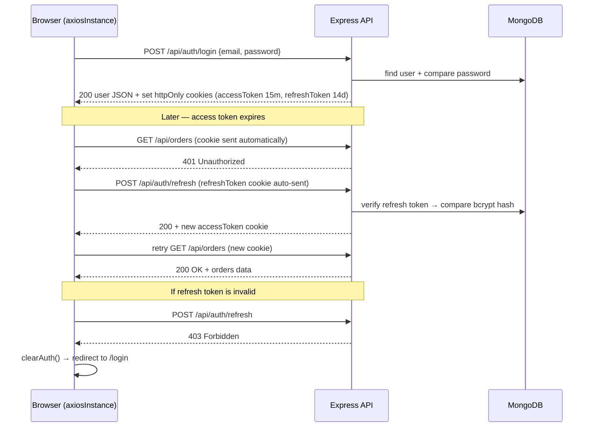

# Authentication Feature

## 1) Problem the Feature Solves

- Users need a secure way to create accounts and sign in to access protected features such as placing orders and viewing order history.
- The system needs to distinguish between **customer** and **admin** roles to protect sensitive admin-only endpoints.
- Short-lived Access Tokens minimize the damage window if a token is compromised, while Refresh Tokens maintain a seamless user session without requiring frequent re-login.
- Tokens are stored in **httpOnly cookies** — never in JavaScript-accessible storage — to protect against XSS attacks.

---

## 2) Scope — Project Boundaries for this Feature

**In Scope:**
- User registration with name, email, and password
- Login setting a short-lived Access Token (15 min) and a long-lived Refresh Token (14 days) as httpOnly cookies
- Silent token refresh — axios interceptor automatically calls `/auth/refresh` on 401 and retries the original request
- Logout — clearing both cookies and invalidating the hashed Refresh Token in the database
- `GET /auth/me` — returning the currently authenticated user; also called on store hydration to validate server-side session
- JWT Auth Middleware — reads Access Token from cookie to protect private routes
- Role Middleware — restricting routes to specific roles (customer / admin)
- Frontend Auth Guard — blocks access to protected pages until hydration is confirmed

**Out of Scope:**
- Social login (Google / Facebook)
- Forgot password / Reset password flow
- Email verification
- Two-factor authentication (2FA)
- Refresh Token family tracking / reuse detection

---

## 3) Deliverables

**Backend:**
| Deliverable | Description |
|---|---|
| `POST /api/auth/register` | Create a new user account — sets httpOnly cookies |
| `POST /api/auth/login` | Authenticate user — sets httpOnly cookies |
| `POST /api/auth/refresh` | Read Refresh Token from cookie, issue new Access Token cookie |
| `POST /api/auth/logout` | Clear both cookies and nullify hashed Refresh Token in DB |
| `GET /api/auth/me` | Return the currently authenticated user (requires valid access cookie) |
| `User` Mongoose Model | Schema with name, email, passwordHash, role, refreshToken (hashed) |
| `authMiddleware.ts` | Reads `req.cookies.accessToken` and verifies JWT |
| `restrictTo(...roles)` | Enforces role-based access control |

**Frontend:**
| Deliverable | Description |
|---|---|
| `axiosInstance.ts` | Axios instance with `withCredentials: true` + 401 interceptor for silent refresh |
| `authApi.ts` | register / login / logout / getMe wrappers |
| `authStore.ts` | Zustand store — persists `user` and `isAuthenticated` only; validates session via `getMe` on hydration |
| `useAuth.ts` | Hook exposing user, isAuthenticated, isAdmin, login, register, logout |
| `AuthGuard.tsx` | Waits for `_hasHydrated` before redirecting — prevents flash redirects on page reload |

---

## 4) User Stories

- "As a new user, I want to register with my name, email, and password so I can create an account."
- "As a registered user, I want to log in so I can access my profile and orders."
- "As a logged-in user, I want my session to stay active without re-logging in every 15 minutes."
- "As a logged-in user, I want to log out so my session ends securely on this device."
- "As an admin, I want my role verified on every request so unauthorized users cannot access admin features."
- "As a returning user, I want to stay logged in after a page refresh without being redirected to login."

---

## 5) Functional Requirements

### 5.1 Register

**Description:** Allows a new user to create an account.

**Preconditions:**
- The email address is not already registered.
- Validation rules are active.

**Main Flow:**
1. User submits `name`, `email`, and `password`.
2. System checks the email is not already in use.
3. System hashes the password using bcrypt (salt rounds = 10).
4. System saves the user record with `role = "customer"`.
5. System generates an Access Token (15 min) and a Refresh Token (14 days).
6. System stores the **hashed** Refresh Token on the user document.
7. System sets both tokens as **httpOnly cookies** on the response.
8. System returns the user object only — no tokens in the response body.

**Alternative Flows:**
- A1: Email already exists → `409 Conflict` — `"Email already exists"`
- A2: Password less than 8 characters → `400 Bad Request` — Mongoose validation error
- A3: Missing required fields → `400 Bad Request`

**Postconditions:**
- User record is stored in the database.
- `accessToken` and `refreshToken` httpOnly cookies are set on the client.
- Frontend store sets `user` and `isAuthenticated: true`.

**Business Rules:**
- BR-001: Email must be unique.
- BR-002: Password must be at least 8 characters.
- BR-003: Password is always stored as a bcrypt hash — never plain text.
- BR-004: Default role is always `"customer"`.
- BR-005: Refresh Token is stored as a bcrypt hash — the raw token is never persisted.

**Data Requirements:**
- `name` — string, required
- `email` — string, required, valid email format
- `password` — string, required, min 8 characters

---

### 5.2 Login

**Description:** Authenticates an existing user and issues tokens as cookies.

**Preconditions:**
- The user exists in the database.

**Main Flow:**
1. User submits `email` and `password`.
2. System finds the user by email (including password field via `select: "+password"`).
3. System compares the submitted password with the stored hash.
4. System generates a new Access Token (15 min) and Refresh Token (14 days).
5. System stores the **hashed** Refresh Token on the user document.
6. System sets both tokens as **httpOnly cookies**.
7. System returns the user object — no tokens in the response body.

**Alternative Flows:**
- A1: Email not found or wrong password → `401 Unauthorized` — `"Invalid credentials"`

**Business Rules:**
- BR-006: The same error message is returned whether the email or the password is wrong — prevents user enumeration attacks.
- BR-007: A new Refresh Token is generated on every login (previous one is overwritten in DB).

**Data Requirements:**
- `email` — string, required
- `password` — string, required

---

### 5.3 Refresh Token

**Description:** Issues a new Access Token cookie using a valid Refresh Token cookie.

**Trigger:** Axios interceptor on the frontend automatically calls this endpoint when any protected request returns `401`.

**Main Flow:**
1. Browser automatically sends `refreshToken` cookie with the request (`withCredentials: true`).
2. System reads `req.cookies.refreshToken` and verifies the signature using `JWT_REFRESH_SECRET`.
3. System finds the user by ID from the token payload.
4. System compares the submitted token against the stored bcrypt hash.
5. System generates a new Access Token (15 min) and sets it as an **httpOnly cookie**.
6. System returns `200 { status: "success" }` — no token in body.
7. Axios interceptor retries the original failed request automatically.

**Alternative Flows:**
- A1: Cookie missing → `401 Unauthorized`
- A2: Token signature invalid or expired → `403 Forbidden`
- A3: User not found → `403 Forbidden`
- A4: Token does not match stored hash → `403 Forbidden`
- A5: Refresh fails → interceptor calls `clearAuth()` and redirects to `/login`

**Business Rules:**
- BR-008: Refresh Token is verified against the stored bcrypt hash — raw token is never stored in DB.
- BR-009: Only the Access Token is rotated on refresh; Refresh Token remains the same until logout or re-login.

---

### 5.4 Logout

**Description:** Invalidates the user's session by clearing cookies and nullifying the DB token.

**Main Flow:**
1. Client calls `POST /api/auth/logout` — cookies are sent automatically.
2. System clears both `accessToken` and `refreshToken` cookies immediately.
3. System attempts to verify the Refresh Token and nullify the hash in the DB.
4. System returns `204 No Content`.
5. Frontend `authStore.clearAuth()` clears `user` and `isAuthenticated`.

**Alternative Flows:**
- A1: Cookie missing → cookies are still cleared; `204` returned silently.
- A2: Token invalid → DB nullification is skipped; `204` returned silently.

**Business Rules:**
- BR-010: After logout the Refresh Token hash is nullified — any subsequent refresh attempts will return `403`.
- BR-011: Logout always succeeds from the client's perspective — even if the token is already invalid.

---

### 5.5 Get Me

**Description:** Returns the currently authenticated user's profile. Also called on app hydration to validate server-side session.

**Preconditions:**
- Valid `accessToken` cookie is present.

**Main Flow:**
1. `protect` middleware reads `req.cookies.accessToken` and verifies the JWT.
2. System queries the DB to confirm the user still exists.
3. System attaches the user to `req.user`.
4. Controller returns `req.user` — password and refreshToken excluded via `select: false`.

**On Hydration (Frontend):**
- `authStore.onRehydrateStorage` calls `GET /api/auth/me` after reading localStorage.
- If valid → sets `user` and `isAuthenticated: true` from server response.
- If invalid (cookie expired) → calls `clearAuth()` to prevent stale UI state.

**Alternative Flows:**
- A1: No cookie → `401 Unauthorized` — `"You are not logged in"`
- A2: Expired or invalid token → `401 Unauthorized`

---

### 5.6 Auth Middleware (protect)

**Description:** Protects private routes by verifying the Access Token from the cookie.

**Main Flow:**
1. Reads `req.cookies.accessToken` — **not** the Authorization header.
2. Verifies the token using `JWT_ACCESS_SECRET`.
3. Queries the database to confirm the user still exists.
4. Attaches the user to `req.user` and calls `next()`.

---

### 5.7 Role Middleware (restrictTo)

**Description:** Restricts a route to one or more specific roles. Must be used after `protect`.

**Main Flow:**
1. Reads `req.user.role` (set by `protect`).
2. If role is not in the allowed list → `403 Forbidden`.
3. Otherwise calls `next()`.

---

### 5.8 Frontend Auth Guard

**Description:** Protects client-side pages from rendering before Zustand hydration is complete.

**Problem it solves:** Without a hydration check, the first render always sees `isAuthenticated = false` because Zustand hasn't read localStorage yet — causing a flash redirect to `/login` even for logged-in users.

**Main Flow:**
1. On mount, `AuthGuard` sets `isHydrated = true` via `useEffect`.
2. Before hydration completes → renders `null` (blank, no redirect).
3. After hydration:
   - Not authenticated → redirect to `/login`.
   - Authenticated but not admin (when `requireAdmin = true`) → redirect to `/`.
   - Authenticated and role matches → renders children.

**Usage:**
```tsx
// Requires login only
<AuthGuard>
  <CheckoutPage />
</AuthGuard>

// Requires admin role
<AuthGuard requireAdmin>
  <AdminDashboard />
</AuthGuard>
```

---

### 5.9 Axios Interceptor — Silent Token Refresh

**Description:** Automatically refreshes the Access Token when any request returns `401`, then retries the original request — completely transparent to the user.

**Main Flow:**
1. Any protected request returns `401`.
2. Interceptor marks the request as `_retry = true` to prevent infinite loop.
3. If another refresh is already in progress → request is queued.
4. Interceptor calls `POST /api/auth/refresh` — cookie is sent automatically.
5. Backend sets new `accessToken` cookie.
6. Interceptor retries the original request and flushes the queue.
7. If refresh fails → `clearAuth()` is called and user is redirected to `/login`.

---

## 6) Non-Functional Requirements

- Passwords are hashed with **bcrypt** at salt rounds = 10.
- Refresh Tokens are stored as **bcrypt hashes** in the DB — never raw values.
- Tokens are stored as **httpOnly cookies** — never in localStorage or JS-accessible storage.
- Cookies use `sameSite: "strict"` and `secure: true` in production — protection against CSRF and network interception.
- All secrets (`JWT_ACCESS_SECRET`, `JWT_REFRESH_SECRET`) are loaded from `.env` — never hardcoded.
- Error messages never expose sensitive internal details.
- `protect` middleware must resolve in under **50ms**.
- The `password` and `refreshToken` fields are excluded from all API responses via Mongoose `select: false`.
- Frontend store persists `user` and `isAuthenticated` only — **tokens are never stored client-side**.

---

## 7) Acceptance Criteria

```
✅ POST /api/auth/register with valid data        → 201 + user data + httpOnly cookies set
✅ POST /api/auth/register with duplicate email   → 409
✅ POST /api/auth/register with password < 8      → 400
✅ POST /api/auth/login with valid credentials    → 200 + user data + httpOnly cookies set
✅ POST /api/auth/login with wrong password       → 401 "Invalid credentials"
✅ POST /api/auth/refresh with valid cookie       → 200 + new accessToken cookie set
✅ POST /api/auth/refresh with expired cookie     → 403
✅ POST /api/auth/logout                          → 204 + both cookies cleared
✅ GET  /api/auth/me with valid access cookie     → 200 + user data
✅ GET  /api/auth/me without cookie               → 401
✅ Admin endpoint with customer token             → 403
✅ password and refreshToken never appear in any response
✅ Axios intercepts 401 → calls refresh → retries original request automatically
✅ Refresh fails → clearAuth() + redirect to /login
✅ Page refresh while logged in → user stays logged in (cookie persists)
✅ AuthGuard on protected page → no flash redirect before hydration completes
✅ GET /api/auth/me called on hydration → stale UI state never shown
```

---

## 8) Architecture — File Responsibility Map

**Backend:**
| File | Responsibility |
|---|---|
| `controllers/authController.ts` | Token signing, cookie setting, refresh and logout logic |
| `models/userModel.ts` | Password hashing (pre-save), stores hashed refresh token, comparePassword / compareRefreshToken |
| `middleware/authMiddleware.ts` | Reads access cookie, verifies JWT, attaches `req.user` |
| `routes/authRouter.ts` | Mounts all auth endpoints |
| `app.ts` | Registers `cookieParser` middleware |

**Frontend:**
| File | Responsibility |
|---|---|
| `infrastructure/http/axiosInstance.ts` | `withCredentials: true`, 401 interceptor with queue logic and clearAuth on failure |
| `infrastructure/api/authApi.ts` | register / login / logout / getMe API wrappers |
| `application/store/authStore.ts` | Persists user + isAuthenticated; calls getMe on hydration; never stores tokens |
| `application/hooks/useAuth.ts` | Exposes user, isAuthenticated, isAdmin, isCustomer, login, register, logout |
| `components/auth/AuthGuard.tsx` | Waits for `_hasHydrated` before auth check — prevents flash redirects |

---

## 9) Token Flow — Sequence Diagram



---

## 10) Security Design Decisions

| Decision | Reason |
|---|---|
| httpOnly cookies for tokens | JavaScript cannot read them — eliminates XSS token theft |
| `sameSite: "strict"` | Prevents CSRF attacks from cross-origin requests |
| `secure: true` in production | Tokens only sent over HTTPS |
| bcrypt hash for Refresh Token in DB | DB leak does not expose raw tokens |
| Short-lived Access Token (15 min) | Limits damage window if cookie is somehow stolen |
| Same error for wrong email/password | Prevents user enumeration attacks |
| `select: false` on password + refreshToken | Never accidentally returned in API responses |
| `clearAuth()` on refresh failure | UI never stays in authenticated state with an invalid session |
| `getMe` called on hydration | Prevents stale localStorage from showing logged-in UI with expired server session |

---

## 11) Priority

🔴 **Must-Have** — Authentication is the foundation all other features depend on.
